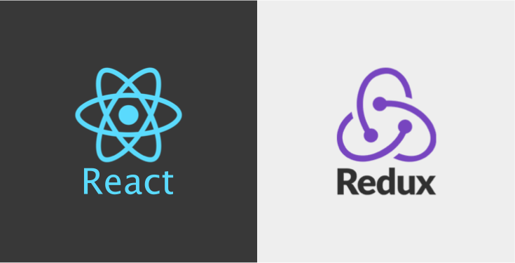
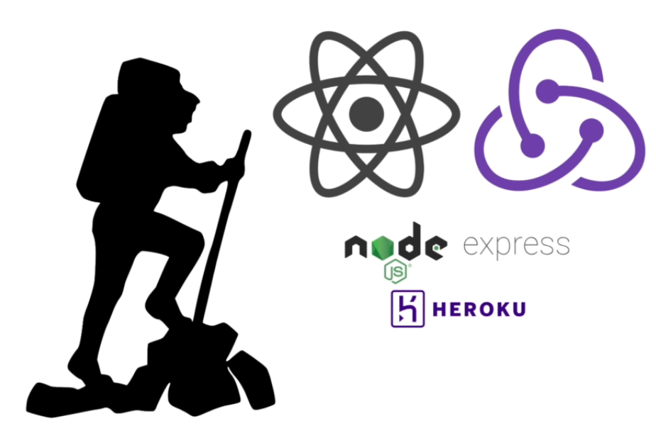

 
  

---

 

 

# ReactJS & Redux Bootcamp 

### " Menjadi Mastah dalam React Web Development ".

 

## Belajar React dan Redux dengan metode terjun bebas! Langsung praktek! 

Membuat apps dan peluang menjadi React Web Developer!

 

## Apa yang akan anda pelajari.

* Bagaimana membuat aplikasi react dengan cepat dengan 'create-react-app'.

* Bagaimana membangun React project dari NOL tanpa 'create-react-app'.

* Bagaimana React sangat sesuai dengan perkembangan project-project website dewasa ini.

* Mengenal React and Redux sebagai Modern dan Best practices Web  Development.

* Bagaimana mengunakan API untuk membuat Aplikasi yang Unik dan Menarik. 

* Mengenal Redux lebih mendalam, bagaimana setiap layer dari Redux app saling berkesuaian.

* Mengenal *bugs* yang muncul, dan cara menangani *bugs* tersebut dan membuat solusi yang paling optimal.

* Deployment React aplikasi, dan belajar bagaimana membuat backend APIs.

 

## Garis besar silabus pembelajaran.

1. Pengenalan & Instalasi.

2. Berkenalan dengan React dan membuat aplikasi React pertama.

3. React dan Web Development.

4. React dan Konsep Utama.

5. Core React Project.

6. Core React Concepts Review.

7. Redux and more Advanced React.

8. Redux Project.

9. Redux Review

10. Create Backend APIs for React Apps

11. React App Deployment

12. Kesimpulan dan Penutup.

 

## Requirements

* Memiliki basic JavaScript.
* Disukai yang familiar dengan command line.

 

## Description

Ingin belajar React dan Redux aplikasi secara langsung ke point nya?

Investasikan waktu anda untuk belajar disini karena disinilah tempat meng-investasi waktu terbaik anda untuk belajar ngoding React dan Redux aplikasi. 

 

## Siapa yang harus mengambil Pelatihan ini?

* Siapa pun anda yang ingin membuat aplikasi frontend React!

* Mereka yang mencari keterampilan sebagai web developer dan mencari pelatihan yang relevan untuk memulai karir mereka.

* Siapa pun yang mencari beberapa proyek untuk ditambahkan ke portofolio mereka.

* Mereka yang ingin membangun aplikasi React dan Redux dengan cara yang benar, dengan kode dan level yang lebih dalam.

* Developer bahasa JavaScript & developer lain yang ingin mengambil next step career dan mempelajari React.

* Pengembang web Backend yang ingin menambahkan frontend ke **Skill Set** mereka. 

 

## Dengan mengikuti Pelatihan ini anda akan:

* Menyelam kedalam React secara langsung, anda akan mendapatkan pengalaman yang mumpuni disini.

* Memahami bagaimana React sangat cocok untuk pengembangan web development masa depan. Anda akan membangun React project dari NOL, discover setiap layer antara React dan browser yang men-display aplikasi React.

* Membuat aplikasi React yang relevan dan menarik. Kami bertaruh Anda akan menemukan aplikasi ini berguna dan menarik. Yang akan menjadi aplikasi portofolio anda dalam belajar React.

* Belajar Redux dengan cara yang benar dan lengkap. Redux adalah suatu keharusan bersanding dengan React. Tetapi memang Redux memiliki kerumitan belajar yang cukup tinggi, karena konsepnya lebih kompleks. Dalam kursus ini, setiap metode Redux akan diambil selangkah demi selangkah. Anda akan menggali lebih dalam tentang cara kerja metode Redux. Anda akan belajar mengapa metode ditulis dengan cara tertentu, dan kapan metode itu harus diterapkan. Dengan begitu, Anda memiliki pemahaman mendalam yang akan memberdayakan diri Anda melakukan koding aplikasi React dan Redux di masa depan.

* Belajar membangun aplikasi keren!  Anda akan membuat game React mini, menggunakan API eksternal. Dan Anda akan membuat aplikasi React yang memiliki fungsionalitas multi-user! Mendukung banyak user adalah bagian penting dari banyak aplikasi web - tetapi bisa sangat sulit untuk dilakukan. Tapi Anda akan menemukan solusinya dalam pelatihan ini secara elegan dan extendable.

* Jelajahi pengembangan backend dari sebuah web. Sangat penting untuk mempertajam keterampilan backend bagi calon atau developer aplikasi React dan Web. Dengan React sebagai aplikasi, Anda akan sering menggunakan API untuk memuat konten aplikasi Anda. Jadi memiliki kemampuan untuk membuat backend dan API sendiri, akan menjadikan anda seorang yang memiliki kemampuan untuk membuat aplikasi React apa pun, tentu nya setelah anda mempunyai tambahan jam terbang setelah anda menyelesaikan kursus ini.

* Men-deploy aplikasi React anda sebagai production stage. Sehingga anda dapat menampilkan product anda live! Ke kalangan ramai :)

  

### Keterangan Kelas

- Minimal kelas 20 orang per batch.
- Maksimal kelas ... orang.
- Total 120 jam belajar. 
- 2 s/d 4 jam per hari.
- 3 s/d 4 hari / minggu.
- Total belajar 3 s/d 4 bulan per batch.
- Sertifikasi BSNP?

   

> Contact MedioCademy.com, WA: 0859-5651-2111